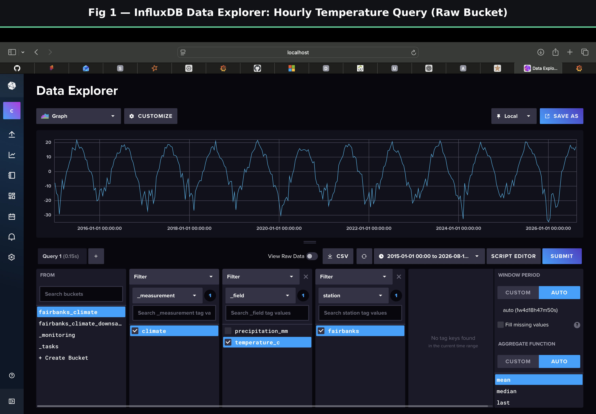
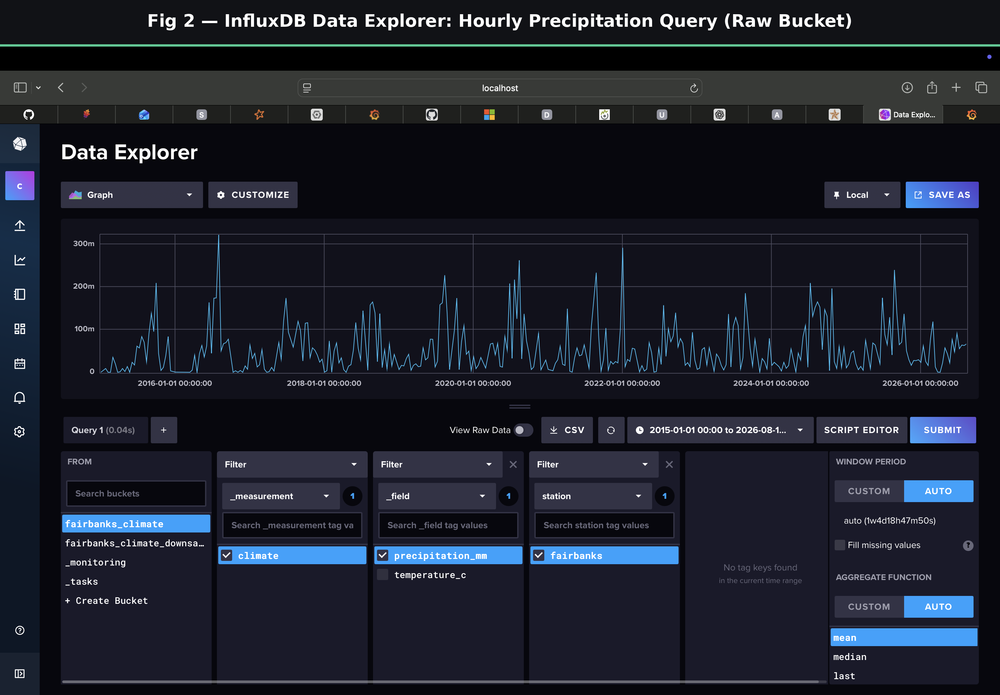
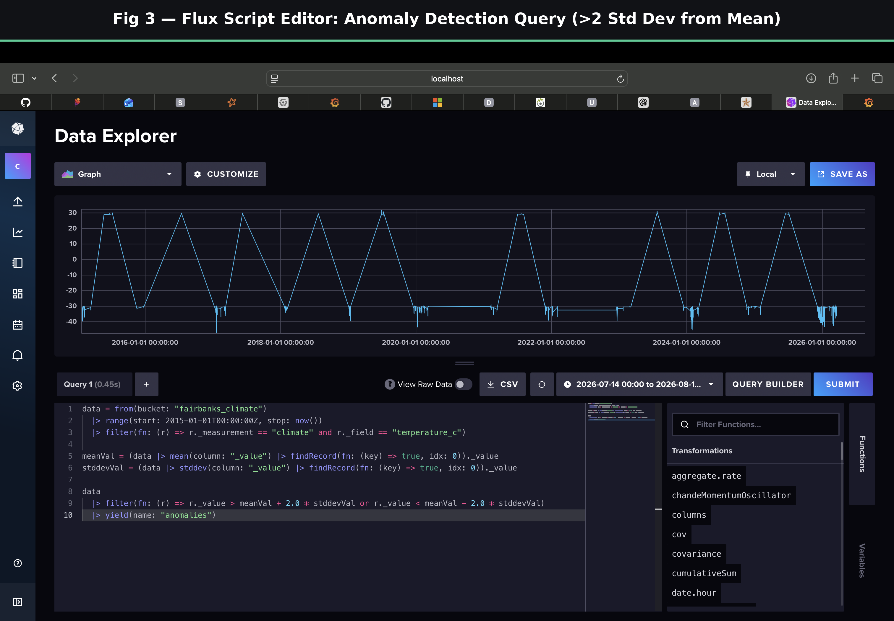
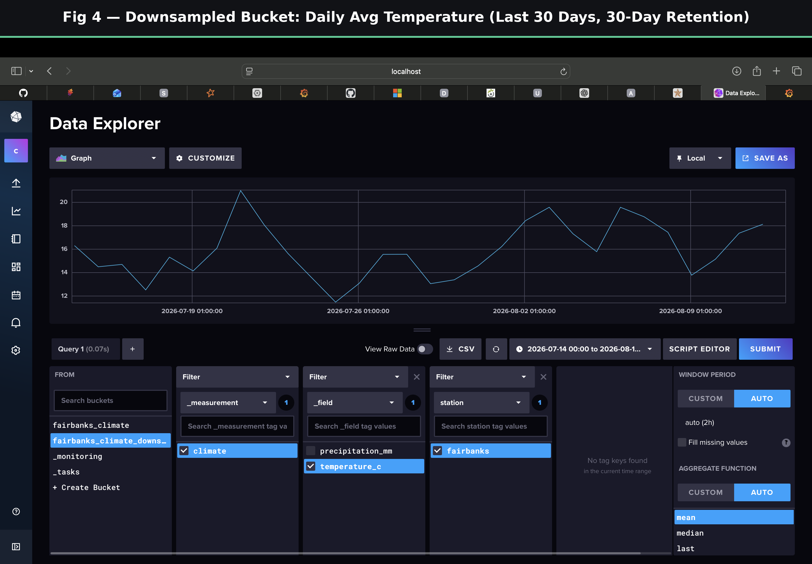
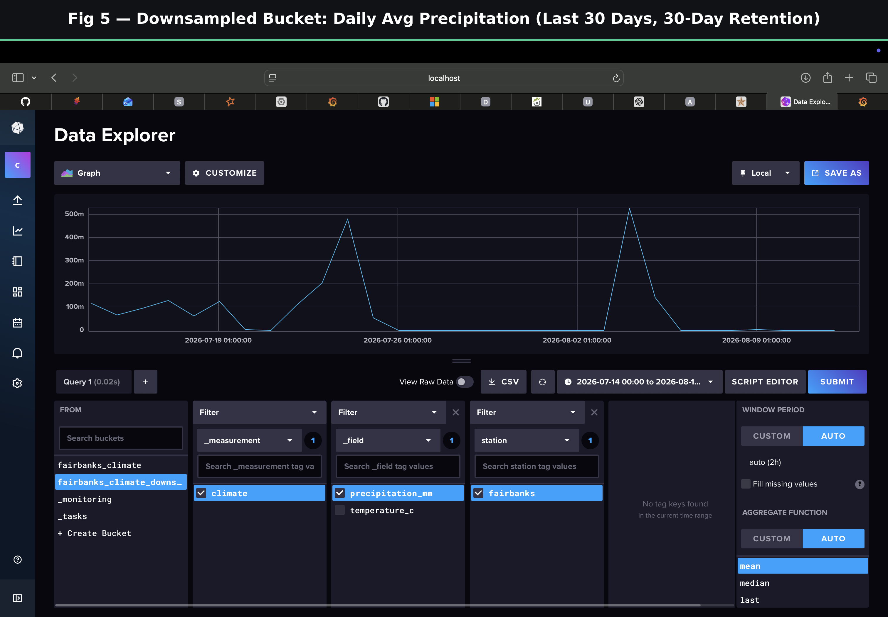
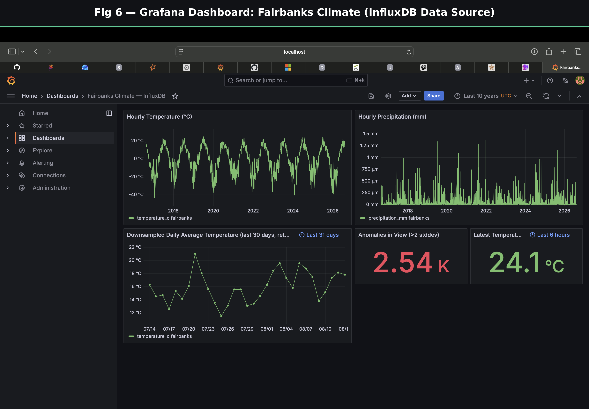

# Task 1: Distributed Time-Series Data Management using InfluxDB

## Objective
Provision InfluxDB v2.x in Docker, ingest real climate time-series data with original
timestamps, and run Flux queries for window aggregation, anomaly detection, and downsampling
with retention.

## 1.1 — Environment
InfluxDB v2.7 runs via `docker-compose.yml`: port 8086 exposed, data persisted to a local
volume, org/bucket/token auto-bootstrapped from `.env` on first start.

## Dataset
The dataset link in the assignment brief no longer serves raw data (redirects to a web app
backed by decadal projection summaries, not a time series). Substituted with real hourly
Fairbanks (Alaska) temperature and precipitation from the
[Open-Meteo Historical Weather API](https://open-meteo.com/en/docs/historical-weather-api),
2015-01-01 through the current date (~101.8k hourly rows).

## 1.2 — Ingestion
A Python script (`scripts/ingest.py`, run via `uv`, using the official `influxdb-client`
package) parses the CSV and writes each row as an InfluxDB point, using the record's own
timestamp — not the time the script ran. Verified: point count in InfluxDB matches the CSV
row count exactly, and sample values/timestamps match the source file.

**Fig 1 & 2** — the ingested hourly data queried back from InfluxDB, full 2015-2026 range,
confirming a clean seasonal pattern with no gaps:

## 1.3 — Flux Queries

**1) Window aggregation** — `aggregateWindow(every: 1h, fn: mean)` computes sliding hourly
averages. Shown above (Fig 1, 2) — since the source is already hourly-resolution, the output
equals the raw readings, correctly demonstrating the mechanism.

**2) Anomaly detection** — flags temperature readings more than 2 standard deviations from the
dataset mean (mean ≈ -0.47°C, stddev ≈ 14.72, thresholds ≈ [-29.90°C, 28.96°C]). Result:
2,878 of 101,808 readings (~2.8%) flagged. Most extreme: **-46.8°C on 2017-01-19** — a real,
documented Fairbanks cold snap, confirming the anomalies are genuine, not noise.

**Fig 3** — the Flux script and its output (note the sawtooth shape: only sparse anomaly points
are plotted, so the line jumps between them across wide time gaps):

**3) Downsampling task** — a recurring InfluxDB Task (`downsample-daily-climate`, runs daily)
aggregates hourly data into daily means, written to a second bucket
(`fairbanks_climate_downsampled`) with an explicit **30-day retention** policy. Since retention
is relative to the current clock, only genuinely recent data can persist there — the source
dataset is kept refreshed through today so this bucket always holds real, current daily
averages, with anything older than 30 days correctly aged out automatically.

**Fig 4 & 5** — the downsampled bucket, last 30 real days only:

## Bonus: Grafana Dashboard
A Grafana instance (also in `docker-compose.yml`, fully config-provisioned — no manual setup)
visualizes both buckets in one dashboard: hourly temperature/precipitation, the downsampled
daily average, a live anomaly count, and the latest reading.

**Fig 6**:

## Summary
| Step | Result |
|---|---|
| 1.1 Environment | InfluxDB running in Docker, persistent, auto-bootstrapped |
| 1.2 Ingestion | 101,808 points, original timestamps verified |
| 1.3 Queries | Hourly aggregation, anomaly detection (2,878 flagged), 30-day downsampling task — all verified |
| Bonus | Grafana dashboard, 5 panels, live-querying InfluxDB |
