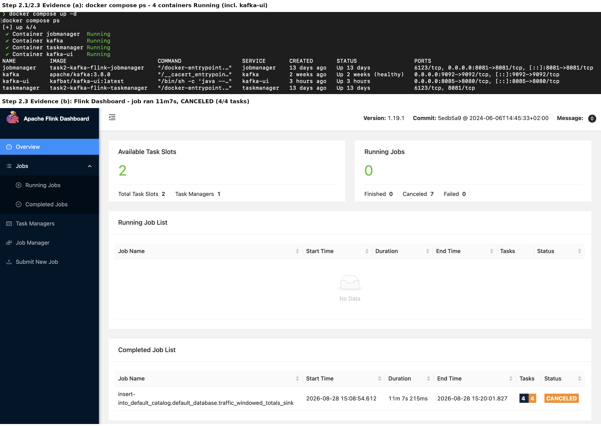
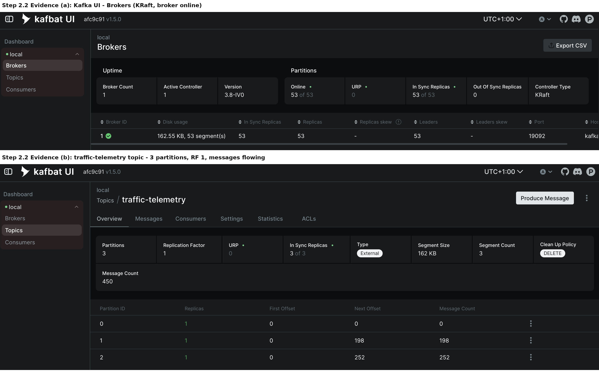
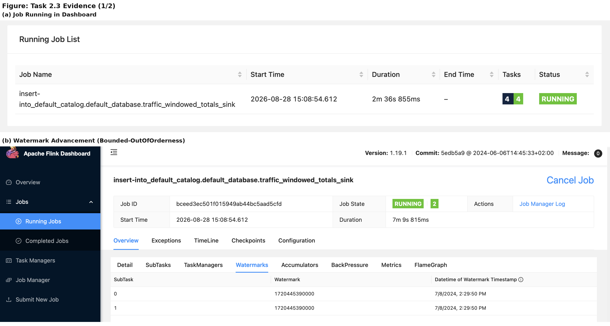
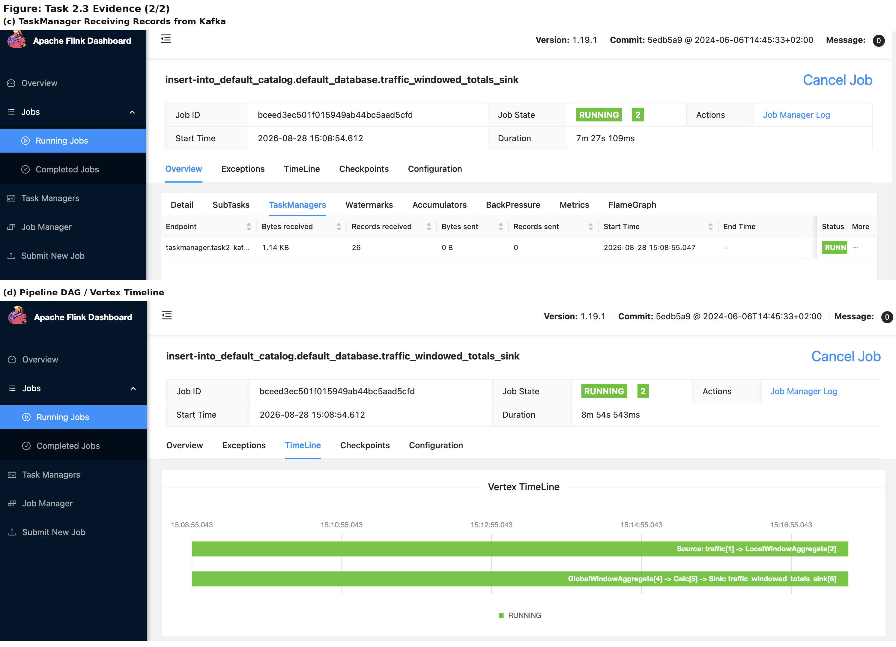
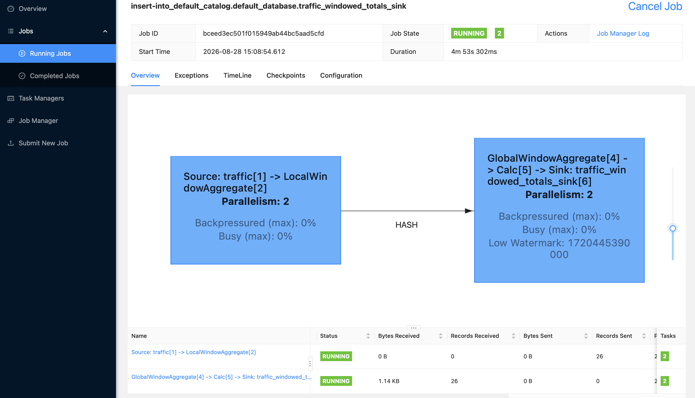
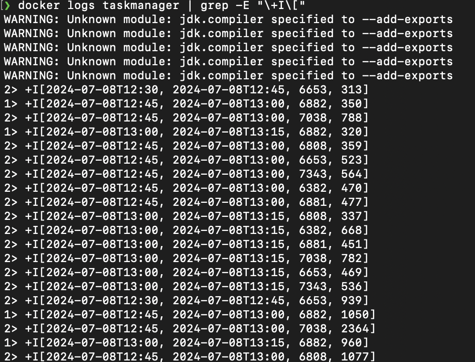

# Task 2: Real-Time Stream Ingestion & Processing using Apache Kafka and Apache Flink

## Objective
Stand up Kafka and Flink in Docker, stream real traffic-sensor data into a partitioned Kafka
topic, and run a Flink job that watermarks on event time and aggregates vehicle counts per
sensor over tumbling windows.

## 2.1 — Environment
Kafka runs in KRaft mode (`apache/kafka:3.8.0`, no ZooKeeper), alongside a Flink JobManager +
TaskManager (`flink:1.19.1-scala_2.12-java11`, extended with a custom `flink-python/Dockerfile`
for PyFlink + the Kafka SQL connector) and Kafka UI (`kafbat/kafka-ui`) for browser-based topic
inspection, all on one Docker network via `docker-compose.yml`.

**Fig 1** — all four containers up, and the Flink dashboard overview panel:



## Dataset
[Austin Camera Traffic Counts](https://data.austintexas.gov/Transportation-and-Mobility/Camera-Traffic-Counts/sh59-i6y9/about_data)
(Socrata) — historical/frozen (last updated 2024-07-08). The 5000 most recent rows are committed
directly to the repo (`data/camera_traffic_counts.csv`), unlike the other tasks' datasets: with
thousands of rows sharing the exact same timestamp, a re-fetch has no unique tie-breaker and
isn't guaranteed to return the same rows.

## 2.2 — Topic + Producer
Topic `traffic-telemetry` — 3 partitions, replication factor 1. `scripts/producer.py` (Python,
`uv`-managed, `confluent-kafka`) sorts the CSV by `read_date` ascending and publishes each row as
JSON, keyed by `atd_device_id` (the sensor ID), so a given sensor's messages consistently land on
the same partition.

**Fig 2** — Kafka UI: broker online (KRaft), and the topic showing 3 partitions / RF 1 / 450
messages delivered. Partition 0 sits at 0 messages — with only 7 distinct sensor IDs hashed
across 3 partitions, none happened to land there; this is expected, and is exactly why the Flink
job needs watermark idleness handling (2.3):



## 2.3 — Windowed Aggregation Job
`jobs/traffic_windowed_totals.py`, submitted via `flink run -d -py` (Flink CLI, inside the
jobmanager container). Built with the Table API / SQL: a Kafka source table with
`WATERMARK FOR read_date AS read_date - INTERVAL '10' SECOND` (bounded-out-of-orderness) and
`'scan.watermark.idle-timeout' = '20s'` (so partition 0's silence doesn't stall the whole job's
watermark), a 15-minute `TUMBLE` window grouped by `atd_device_id` with `SUM(volume)`, and a
`print` sink.

*(Window is 15 minutes, not the brief's 10 — the source data is itself pre-aggregated into
15-minute bins, so a 10-minute window doesn't divide evenly and silently drops 1 in every 3
windows. 15 minutes maps every window 1:1 onto a real observation bin instead.)*

**Fig 3** — (a) job `RUNNING` in the dashboard; (b) watermark advancing to a real event-time
value (`2024-07-08, 2:29:50 PM`), confirming it's driven by the data's own timestamps, not
processing time:



**Fig 4** — (c) the TaskManager actively receiving records from Kafka; (d) the pipeline's vertex
timeline, both stages (`Source → LocalWindowAggregate` and `GlobalWindowAggregate → Calc → Sink`)
running continuously:



**Fig 5** — the job's DAG: source/local-aggregate stage hash-partitioned into the
global-aggregate/sink stage, parallelism 2, low watermark shown in the second vertex:



**Fig 6** — actual sink output (`docker logs taskmanager`), rows aligned to real 15-minute bins,
one total per sensor per window:



## Sustained Live Run (Extended Verification)
Beyond the pre-loaded-batch demo above, the pipeline was also run continuously at the producer's
default cadence (one message every 2 seconds, not a fast burst) against a freshly reset topic, to
confirm it holds up under genuine ongoing streaming rather than a single instant push.

| | |
|---|---|
| Job state | `RUNNING`, healthy, no restarts or failures |
| Duration | 18.83 minutes (continuous) |
| Windows fired | 57 |
| Messages produced | 421 (182 on partition 1, 239 on partition 2, 0 on partition 0 — same expected idle-partition behaviour as Fig 2) |

Sample of the window output from this run, correctly progressing through real 15-minute
event-time bins as the watermark advanced:
```
+I[2024-07-08T12:45, 2024-07-08T13:00, 6881, 477]
+I[2024-07-08T12:45, 2024-07-08T13:00, 6382, 470]
+I[2024-07-08T13:00, 2024-07-08T13:15, 6653, 469]
+I[2024-07-08T13:00, 2024-07-08T13:15, 7038, 782]
+I[2024-07-08T13:00, 2024-07-08T13:15, 6808, 337]
+I[2024-07-08T13:00, 2024-07-08T13:15, 6881, 451]
```
In 18.83 real minutes, the job correctly advanced through 4 successive 15-minute bins
(12:30→12:45→13:00→13:15), firing 57 window-close events in step with the watermark — genuine
sustained streaming behaviour, not just a one-off batch result.

## Design Notes
Two issues came up worth recording. First, a Kafka partition with zero traffic (Fig 2) silently
stalls Flink's watermark forever, since Flink takes the minimum watermark across all partitions —
fixed with `scan.watermark.idle-timeout`. Second, an initial DataStream-API version of this job
(`.map()`/`.key_by()`/`.window()`/`.reduce()`) looked correct and ran without errors, but never
actually fired a window even after 15+ minutes of runtime — DataStream Python UDFs run
out-of-process through Apache Beam's Python worker bridge, and watermark propagation across that
boundary proved unreliable. Rewriting the same logic as Table API / SQL (shown above) avoids
Python UDFs entirely and fired correctly within seconds. Full detail in `README.md`.
