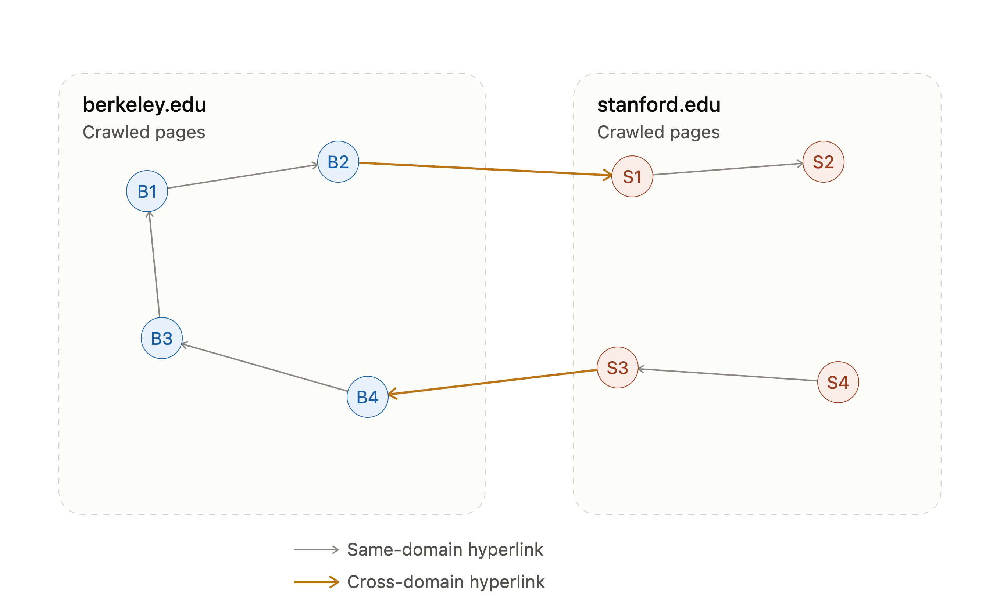
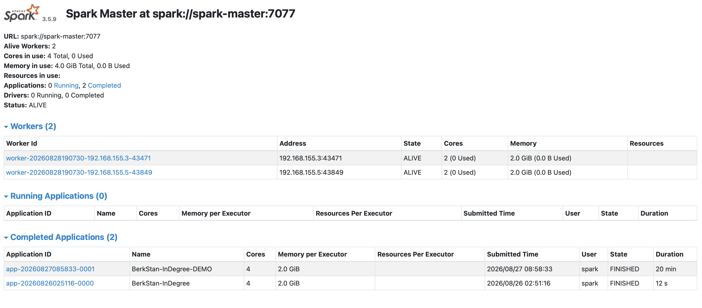
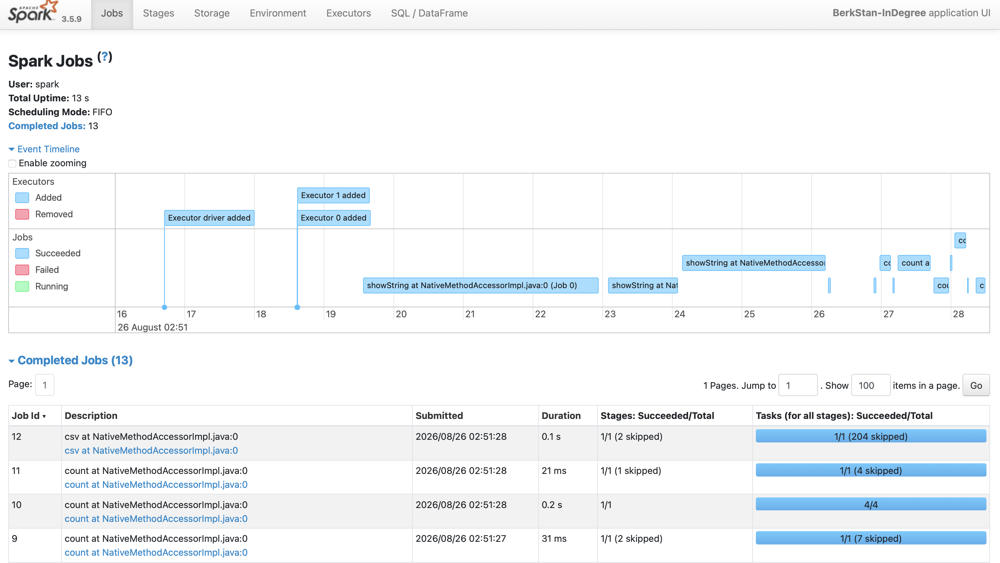
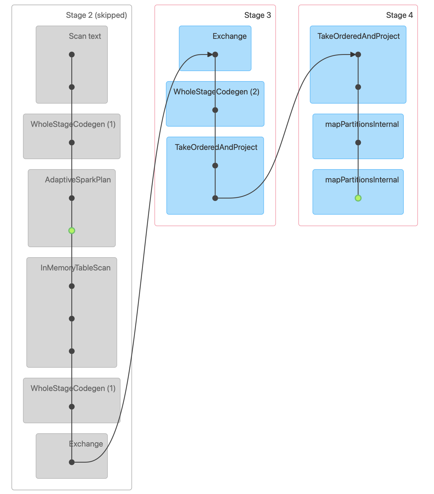

# Task 3: Scalable Data Analytics with Apache Spark

## Objective
Run a standalone Spark cluster in Docker (1 master, 2 workers capped at 2 cores/2GB each),
use PySpark to parse the SNAP `web-BerkStan` graph, compute the in-degree distribution, and
identify the top 50 destination nodes with caching/broadcast-join optimizations. Capture stage
durations, DAG structure, and shuffle/skew evidence from the Spark UI.

**Dataset:** [SNAP web-BerkStan](https://snap.stanford.edu/data/web-BerkStan.html) — 685,230
nodes, 7,600,595 directed edges. Each node is a crawled page from berkeley.edu or stanford.edu;
each directed edge is a hyperlink from one page to another, same-domain or cross-domain:



## 3.1 — Cluster
`docker-compose.yml` runs `apache/spark:3.5.9-python3` as one master (UI :8080, RPC :7077) and
two workers, each capped at 2 cores / 2GB via both Spark worker flags and Docker
`deploy.resources.limits`. A fourth `spark-history` service (port 18080) reads a shared
event-log volume (`data/spark-events/`, configured in `conf/spark-defaults.conf`) so completed
job metrics stay inspectable after the driver exits.

Confirmed via the master's REST endpoint — both workers registered ALIVE with 2 cores / 2.0 GiB
each (4 cores / 4GB total):

**Fig 1** — Spark master UI (`localhost:8080`) showing both workers ALIVE:


## 3.2 — PySpark Job
`scripts/indegree_job.py`, submitted via `spark-submit --master spark://spark-master:7077`:
1. `spark.read.text()` lazily loads the raw edge list (no computation until an action runs).
2. Filters `#`-comment header lines, splits each row on `\s+` (the source file uses
   tab-separated values with trailing `\r`), casts to `(src, dst)` long columns.
3. `.cache()`s the parsed edges DataFrame since it's reused for both the in-degree aggregation
   and the broadcast join.
4. `groupBy("dst").count()` computes in-degree per destination vertex, `orderBy(desc).limit(50)`
   takes the top 50.
5. Broadcast-joins the (tiny) top-50 set back against the full edge list — `F.broadcast(hub)` —
   to count how many of the 7.6M edges land on a top-50 hub node, without shuffling the full
   edge table.

**Result:**

| Metric | Value |
|---|---|
| Total edges parsed | 7,600,595 |
| Distinct destination vertices | 617,094 |
| Top in-degree node | `438238` — in-degree 84,208 |
| Edges landing on a top-50 hub | 1,371,189 (~18% of all edges) |

Top 10 destination nodes by in-degree:

| dst | in_degree |
|---|---|
| 438238 | 84,208 |
| 401873 | 48,205 |
| 184094 | 44,290 |
| 768 | 44,101 |
| 927 | 44,067 |
| 184142 | 44,041 |
| 184279 | 44,037 |
| 184332 | 44,034 |
| 33 | 44,032 |
| 743 | 44,022 |

The full top-50 output is in
[`output/top50_indegree/top50_indegree.csv`](output/top50_indegree/top50_indegree.csv).

## 3.3 — Spark UI Evidence
Captured from the Spark History Server (`localhost:18080`) for application
`app-20260826025116-0000`, cross-checked against the REST API (`/api/v1/applications/.../stages`,
`.../executors`) to confirm the UI numbers.

### Stage durations & shuffle
The job resolved into 26 stages (many `SKIPPED` — reused from the cached `edges` DataFrame across
the repeated actions). Completed stages:

| Stage | Operation | Tasks | Exec time (s) | Input | Shuffle read | Shuffle write |
|---|---|---|---|---|---|---|
| 0 | text file scan (`show`) | 4 | 10.32 | 110.5 MB | — | — |
| 1 | filter/split/cast → shuffle write (groupBy map side) | 4 | 3.28 | 25.0 MB | — | 5.65 MB |
| 3 | groupBy reduce + sort (`show`) | 200 | 3.95 | — | 5.65 MB | 0.14 MB |
| 4 | limit merge | 1 | 0.02 | — | 0.14 MB | — |
| 11 | edges.count() (cached, re-scan) | 4 | 0.43 | 25.0 MB | — | — |
| 14 | broadcast join + count | 4 | 1.58 | 25.0 MB | — | 3.42 MB |
| 16 | join reduce-side count | 3 | 0.45 | — | 3.42 MB | — |
| 20 | in_degree.count() | 4 | 0.52 | 25.0 MB | — | — |
| 25 | write top-50 CSV | 1 | 0.06 | — | — | — |

Total application wall time: **12.5s** (start 02:51:16.008 → end 02:51:28.521 UTC).

**Fig 2** — History Server job timeline (13 jobs, one per Spark action — `show`, four `count`s,
the broadcast-join `count`, and the final `csv` write):


**Fig 3** — Stage 1 detail page showing the DAG for the parse → cache → groupBy shuffle:


### Partition skew evidence
The initial text-scan stage (stage 0, 4 tasks — one per core across the 2 workers) shows real
skew: Spark splits the 110MB input file by **byte offset**, not by line count, so each task reads
a similar number of bytes but a different number of complete records:

| Task | Executor host | Duration | Input | Records read |
|---|---|---|---|---|
| 0 | 192.168.155.5 | 3266 ms | 28.7 MB | 2,163,123 |
| 1 | 192.168.155.3 | 3076 ms | 28.7 MB | 1,905,925 |
| 2 | 192.168.155.5 | 3141 ms | 28.7 MB | 1,905,676 |
| 3 | 192.168.155.3 | 2936 ms | 24.4 MB | 1,625,875 |

Record count varies **33%** between the busiest and lightest task (2.16M vs 1.63M) purely from
line-length variation near block boundaries, even though byte-size per partition is near-uniform.

By contrast, the groupBy shuffle's 200 reduce-side tasks (stage 3) show almost **no** skew —
shuffle-read bytes ranged only 27.4KB–29.2KB (p5–p95), a ~6% spread — because Spark's default
hash partitioner distributes the (roughly uniformly distributed integer) `dst` node IDs evenly
across 200 partitions.

At the executor level, load stayed balanced across both workers — evidence the 2-core/2-worker
cap didn't starve either node:

| Executor | Host | Tasks | Input | Shuffle read | Shuffle write | Total task time |
|---|---|---|---|---|---|---|
| 0 | 192.168.155.3 | 115 | 102.1 MB | 3.89 MB | 4.66 MB | 13.4 s |
| 1 | 192.168.155.5 | 115 | 108.3 MB | 5.32 MB | 4.55 MB | 14.5 s |

**Fig 4** — History Server executors tab confirming the balanced task/byte split above:


## Reproducing
```bash
cd task3-spark
docker compose up -d
docker exec spark-master /opt/spark/bin/spark-submit \
  --master spark://spark-master:7077 \
  --executor-memory 2g --executor-cores 2 --total-executor-cores 4 \
  /opt/spark-apps/indegree_job.py
```
Master UI: http://localhost:8080 · History Server: http://localhost:18080
