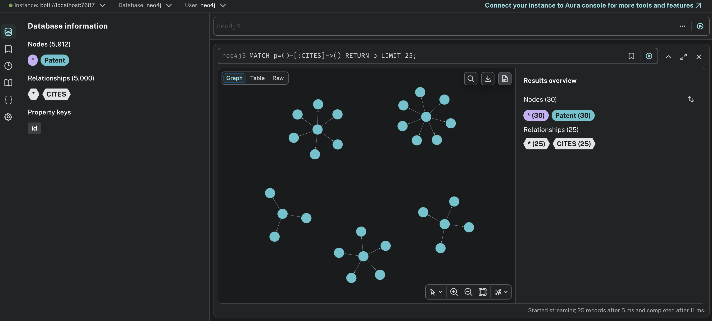
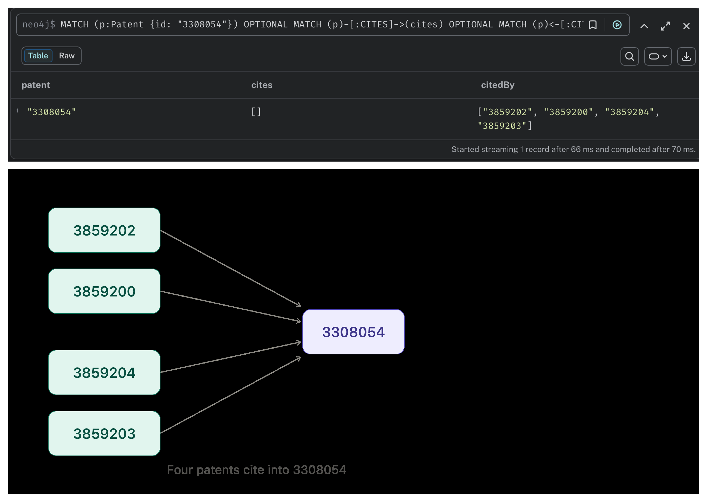
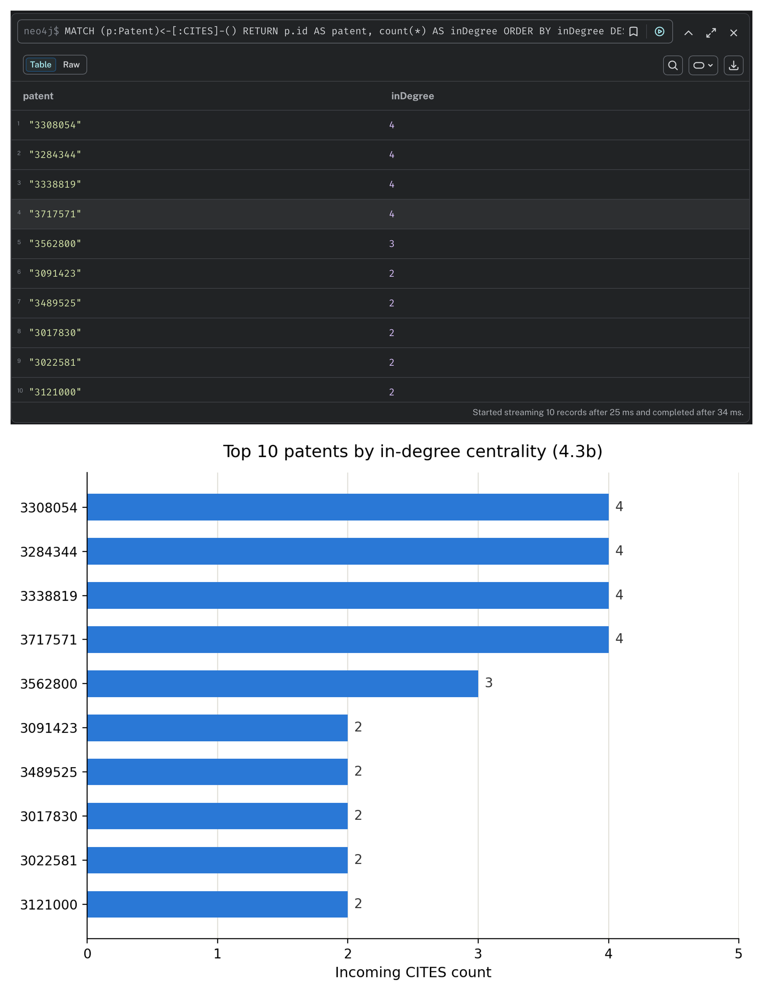
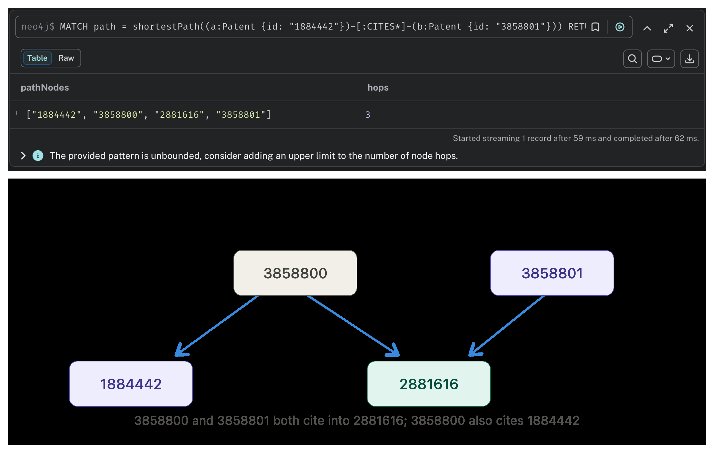

# Task 4: Graph Database Engineering using Neo4j

## Objective
Run Neo4j Community Edition in Docker, bulk-load the first 5,000 citation edges from the SNAP
cit-Patents dataset via `LOAD CSV`, and write Cypher queries for neighbor lookup, in-degree
centrality, and shortest path.

## 4.1 — Environment
Neo4j 5 Community runs via `docker-compose.yml`: ports 7474 (browser) and 7687 (Bolt) exposed,
custom credentials (`neo4j`/`patents123`) set via `NEO4J_AUTH`, data persisted to a local
bind-mounted volume. Browser login at `localhost:7474` verified directly.

## Dataset
[SNAP cit-Patents](https://snap.stanford.edu/data/cit-Patents.html) — a directed US patent
citation graph. The first 5,000 edges are streamed from the source gzip (stopping early, so the
full ~85MB file is never downloaded) via `scripts/prepare_data.sh`.

## 4.2 — Bulk Load
`scripts/load_patents.cypher` creates a uniqueness constraint on `Patent.id`, then uses
`LOAD CSV WITH HEADERS` + `MERGE` to load the 5,000 edges into `(:Patent)-[:CITES]->(:Patent)`.
Verified: 5,000 `CITES` relationships across 5,912 distinct `Patent` nodes (fewer nodes than
2×5,000 since several patents appear as both citing and cited across rows).

**Fig 1** — the loaded graph in Neo4j Browser: database info panel confirming the node/relationship
counts, and a sample `MATCH p=()-[:CITES]->() RETURN p LIMIT 25` visualization showing the
citation structure:

## 4.3 — Cypher Queries
All three queries are in `scripts/queries.cypher`, output captured in `scripts/queries_output.log`.

**a) Direct neighbors** — both citing and cited directions for a given patent. Patent `3308054`
has no outgoing citations in this sample but is cited by 4 patents.

**Fig 2**:

**b) In-degree centrality** — top patents by incoming `CITES` count. With only a 5,000-edge
sample, the graph is sparse: the top in-degree is 4, shared by four patents (`3308054`,
`3284344`, `3338819`, `3717571`).

**Fig 3**:

**c) Shortest path** — between two patents not directly connected. `shortestPath` on
`1884442` → `3858801` (undirected `CITES*`, since the sample has no multi-hop *directed* chains
at this size) finds a true shortest path of 3 hops, via intermediate patents `3858800` and
`2881616`.

**Fig 4**:

